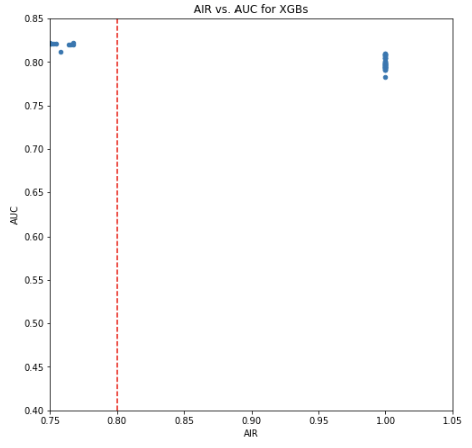
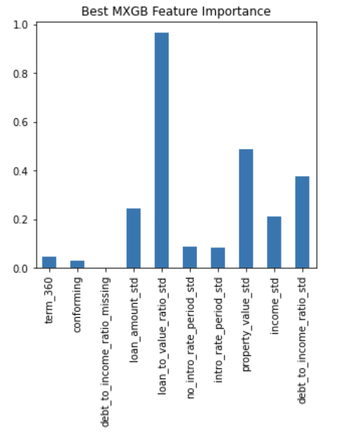
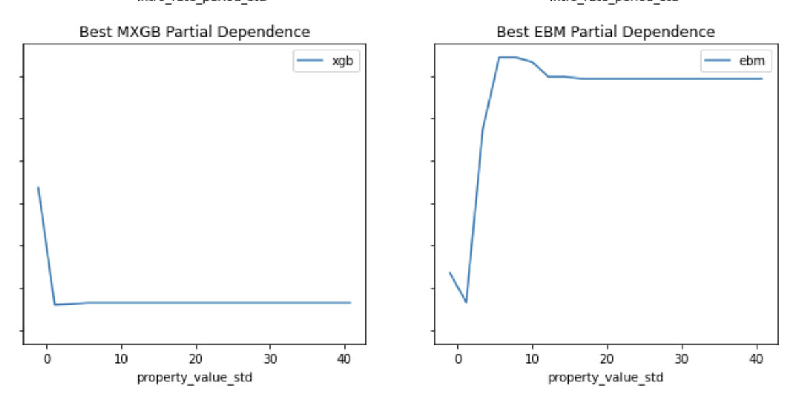
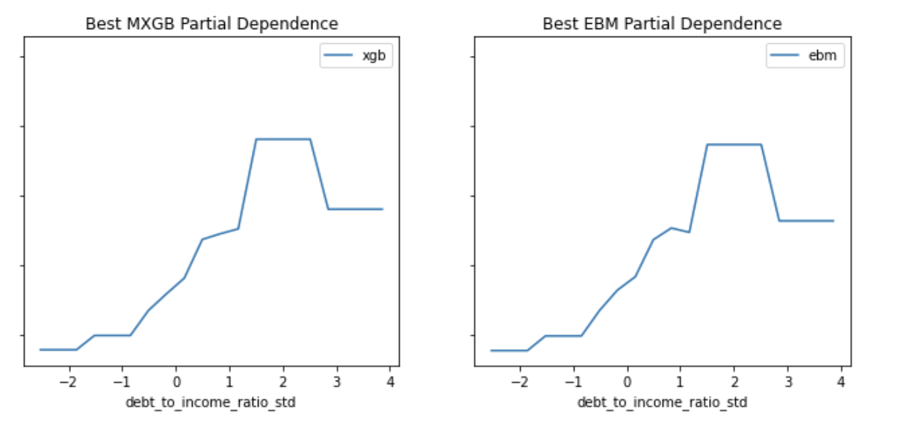

# GWU_RML

* **Person or organization developing model**: Melis Diken 'midiken@gwu.edu'
* **Model date**: June, 2022
* **Model version**: 1.0
* **License**: Apache License

### Intended Use
* **Primary intended uses**: To predict whether (1) or not (0) the annual percentage rate (APR) charged for a mortgage is 150 basis points (1.5%) or more above a survey-based estimate of similar mortgages.
* **Primary intended users**: Students in GWU DNSC 6290
* **Out-of-scope use cases**: Any use beyond an educational example is out-of-scope.

### MXGB Model Design
The MXGB model was designed to address:
* **Discrimination by testing and remediating using adverse impact ratio (AIR)** [See notebbok](Assignment_3/Assignment_3.ipynb)
   *  Figure 1 shows a simple random grid with AIR on the x-axis and area under the curve (AUC) on the y-axis which yields various options for accurate and less discriminatory models
* 

* **Security by conducting a white-hat model extraction attack and identifying vulnerabilities** [See notebbok](Assignment_4/Assignment_4.ipynb)
   *  Figure 2 shows a stolen decision tree model that creates adversarial examples which allowed to identify vulnerabilities
* 

* **Accuracy by conducting residual analysis and remediating discovered bugs** [See notebbok](Assignment_5/Assignment_5.ipynb)
   *  Figure 3 shows the residual analysis that shows if the model struggles to predict when customers will recieve a high-priced loan correctly 
* 

### Training Data

* Data dictionary: 

| Name | Modeling Role | Measurement Level| Description|
| ---- | ------------- | ---------------- | ---------- |
|**high_priced**| target | int | whether (1) or not (0) the annual percentage rate (APR) charged for a mortgage is 150 basis points (1.5%) or more above a survey-based estimate of similar mortgages |
| **conforming** | input | int | whether the mortgage conforms to normal standards (1), or whether the loan is different (0) |
| **debt_to_income_ratio_std** | input | int | standardized debt-to-income ratio for mortgage applicants
| **debt_to_income_ratio_missing** | imput | int | missing marker (1) for debt to income ratio std |
| **income_std** | input | int | standardized income for mortgage applicants |
| **loan_amount_std** | input | int | standardized amount of the mortgage for applicants |
| **intro_rate_period_std** | imput | int | standardized introductory rate period for mortgage applicants |
| **loan_to_value_ratio_std** | input | int |  ratio of the mortgage size to the value of the property for mortgage applicants |
| **no_intro_rate_period_std** | input | int | whether (1) or not (0) a mortgage does not include an introductory rate period |
| **property_value_std** | input | int | value of the mortgaged property |
| **term_360**| input | int | whether the mortgage is a standard 360 month mortgage (1) or a different type of mortgage (0) |
| **male** | demographic information | int | whether a person identifies as male (1) or not male (0) |
| **female** | demographic information | int | whether a person identifies as female (1) or not female (0) |
| **black** | demographic information | int | whether a person identifies as black (1) or not black (0) |
| **asain** | demographic information | int | whether a person identifies as asian (1) or not asian (0) |
| **white** | demographic information | int | whether a person identifies as white (1) or not white (0) |
| **amind** | demographic information | int | whether a person identifies as amind (1) or not amind (0) |
| **hipac** | demographic information | int | whether a person identifies as hispac (1) or not hispac (0) |
| **hispanic** | demographic information | int | whether a person identifies as hispanic (1) or not hispanic (0) |
| **non_hispanic** | demographic information | int | whether a person identifies as non_hispanic (1) or not non_hispanic (0) |
| **agegte62** | demographic information | int | whether a person is over the age of 62 (1) or not over the age of 62 (0)|
| **agelt62E** | demographic information | int | whether a person is below the age of 62 (1) or not below the age of 62 (0) |
| **row_id** | ID | int | unique row indentifier |

* **Source of training data**: GWU Blackboard, email `jphall@gwu.edu` for more information
* **Number of rows in training data**:
  * Training rows: 160,338

### Test Data
* **Source of test data**: GWU Blackboard, email `jphall@gwu.edu` for more information
* **Number of rows in test data**: 19831
* **State any differences in columns between training and test data**: None

### Model Details
* **Columns used as inputs in the final model**: 'property_value_std', 'no_intro_rate_period_std', 'loan_amount_std', 'income_std', 'conforming', 'intro_rate_period_std', 'debt_to_income_ratio_std', and 'term_360'

* **columns used as targets in the final model**: 'high_priced'
* **Type of model**: XGBoost
* **Software used to implement the model**: 'xgboost', 'H20', 'interpret.glassbox', 'interpret.perf', 'numpy', 'pandas', 'time', 'matplotlib.pyplot', and 'matplotlib.lines'.
* **Version of the modeling software**: 'xgboost 1.4.2', 'h20 3.36.1.1', 'interpret 0.2.4', 'numpy 1.18.5', and 'pandas 1.0.5
* **Hyperparameters or other settings of your model**: 'colsample_bytree': 0.3, 'colsample_bylevel': 0.9, 'eta': 0.005, 'max_depth': 7, 'reg_alpha': 0.05, 'reg_lambda': 0.0005, 'subsample': 0.7, 'min_child_weight': 10, 'gamma': 0.4, 'booster': 'gbtree', 'eval_metric': 'auc', 'monotone_constraints': (1,), 'nthread': 4, 'objective': 'binary:logistic', 'seed': 12345

### Quantitative Analysis
* **XGBoost is the best model when compared to alternative models, like the penalized general linear model (GLM) and explainable boosting machine (EBM) model, because it is ranked highest on average across metrics and folds

* **Global feature importance**:

* the global feature importance for the XGBoost model, with 'loan_to_value_ratio_std', 'property_value_std', and 'debt_to_income_ratio_std' having the highest importance.
* 

* **Partial Dependence for Top 3 Most Important Variables**:
* 
* 
* 

### Ethical Considerations

* **Potential negative impacts of using the the MXGB model**:
   * Not having good appeal procedure for customers who were denied a mortgage that can lead to serious consequences for the customers
   * Variables that can improve accuracy but also can be bais due to structural inequality like debt to income ratiosE

* **Potential uncertainties relating to the impacts of using our MXGB model**:
    * Updated packages can change the MXBG model 
    * Economic events affecting model preformance
    * Legal implications in a real-word implementation 

* **Unexpected Results**:

